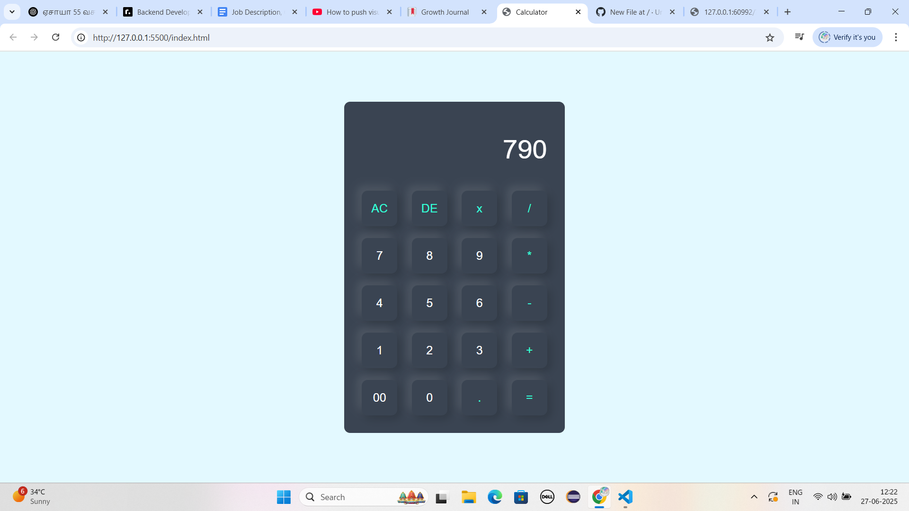

# Calculator Webpage

A simple and responsive calculator web application built using HTML and CSS. This project performs basic arithmetic operations like addition, subtraction, multiplication, and division. It is designed with a clean and minimal user interface for easy usability.

# Features

- Addition, subtraction, multiplication, and division
- Responsive layout for desktops and mobile devices
- Simple and user-friendly interface
- Clean and modern CSS design

## Tech Stack

- HTML5 – for building the structure
- CSS3 – for styling and layout

## Preview

  
